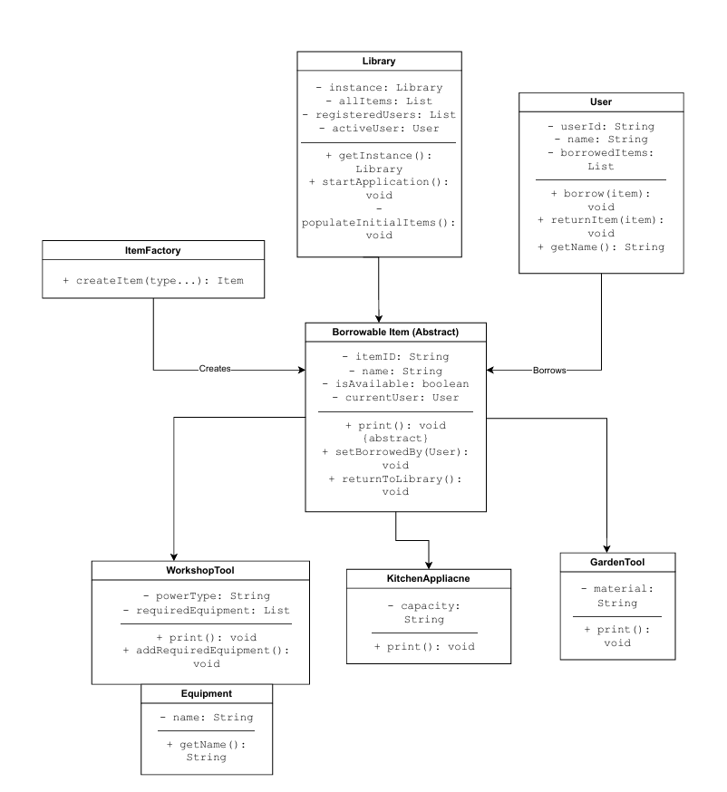

# 📖 Library of Stuff
This repository contains the Java console application for the "Library of Stuff" project. The application is designed to manage a lending library for various household and workshop items.

## Sprint 2 Submission
**Deadline:** Monday, 24 November 2025

This submission builds upon the Sprint 1 foundation by adding a complete, interactive booking system, user management, and advanced design patterns.

### 🏗️ Key Features Implemented
* **Design Patterns (Advanced Requirement):**
    * **Singleton Pattern:** Applied to the `Library` class to ensure only one central inventory exists throughout the application lifecycle.
    * **Factory Pattern:** Implemented in `ItemFactory` to centralize and decouple the creation logic for different item types (`WorkshopTool`, `KitchenAppliance`, `GardenTool`).
* **User Management & Loyalty System:**
    * **User Class:** A new `User` class was created to represent library members.
    * **Loyalty Points:** An advanced feature where users automatically earn **10 Loyalty Points** for every item they successfully borrow.
* **Interactive Console Menu:** The `Main` class launches a robust, loop-based menu handled by the `Library` singleton.
* **Booking System (State Management):**
    * **Borrowing:** Users can borrow available items. This updates the item's status and links the item to the specific user (**Association**).
    * **Returning:** Users can return items they possess. The system validates that the user actually has the item before accepting the return.
* **Aggregation:** The `User` class maintains a list of `borrowedItems`, demonstrating the "has-a" collection relationship.

### 📊 Class Diagram
Below is the high-level design of the application, showing the Singleton Library, ItemFactory, and relationships between Users and Items.


*(Note: If the image above does not load, please see the file 'Sprint 2 Class Diagram.pdf' in the root directory)*

---

## Sprint 1 Submission
**Deadline:** 24-October-2025

This submission covers all basic and advanced requirements for Sprint 1. The focus is on building a solid Object-Oriented foundation for the application.

### 🏗️ Key Features Implemented
The project successfully demonstrates the core principles of Object-Oriented Programming:

* **Abstraction:** An abstract `BorrowableItem` class is used as a blueprint, defining common attributes and behaviors for all items.
* **Inheritance:** Specific item classes (`WorkshopTool`, `KitchenAppliance`, `GardenTool`) inherit from the `BorrowableItem` parent class.
* **Encapsulation:** All class properties are kept `private` and are only accessible through public getter methods.
* **Polymorphism:** The `Library` class treats all objects as their parent type (`BorrowableItem`) and calls the same `.print()` method, which executes the correct overridden version for each object.
* **Composition:** To meet the advanced requirement for higher marks, a `WorkshopTool` "has-a" `List` of `Equipment` objects.

---

## 📁 File Structure
The `src` folder contains all the necessary Java source code:

* `Main.java`: The entry point. It calls `Library.getInstance()` and starts the app.
* `Library.java`: **(Singleton)** Manages the inventory, users, and application loop.
* `User.java`: Represents a library member, tracks borrowed items and **Loyalty Points**.
* `ItemFactory.java`: **(Factory)** Handles the creation of complex item objects.
* `BorrowableItem.java`: The abstract parent class for all items.
* `WorkshopTool.java`: A child class for tools. Demonstrates **Composition** with `Equipment`.
* `KitchenAppliance.java`: A child class for appliances.
* `GardenTool.java`: A child class for garden tools.
* `Equipment.java`: A helper class for the composition relationship.

---

## 🚀 How to Run the Project
### Prerequisites:
* Java Development Kit (JDK) 17 or newer.
* An IDE like IntelliJ IDEA (Community Edition) or Visual Studio Code.

### Execution Steps:
1.  Open the project's root folder in your IDE.
2.  Navigate to the `src/Main.java` file.
3.  Click the "Run" button that appears above the `public static void main(String[] args)` method.
4.  The program will launch in the integrated terminal.

---

## Expected Output
The application now features a simulated login and loyalty point tracking:

```text
=====================================
   WELCOME TO THE LIBRARY OF STUFF   
=====================================

--- User Selection ---
- U001: Alice Smith
- U002: Bob Jones
- U003: Charlie Brown
Enter User ID to login: U001
Welcome, Alice Smith!
Current Loyalty Points: 0

1. View All Items
2. Borrow Item
3. Return Item
4. Exit
Choose: 2

--- Borrow an Item ---
WT001: Cordless Drill
KA001: High-Speed Blender
GT001: Digging Spade
Enter ID to borrow: WT001

Success! You borrowed Cordless Drill
You earned 10 Loyalty Points! Total: 10
